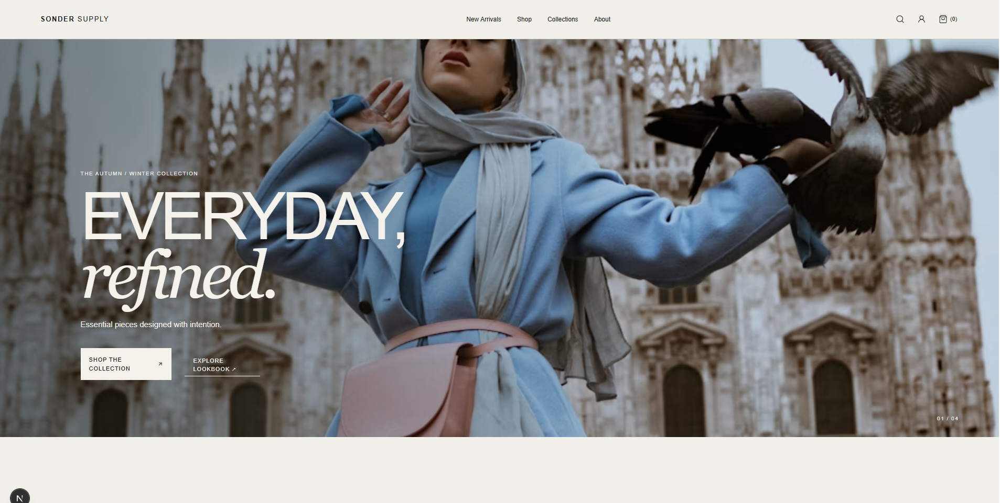

# 👕 Sonder Supply Website

A modern, refined, and responsive clothing brand website built with **Next.js, TypeScript, and Tailwind CSS**.

This project is part of **Webverox's demo projects**, created to showcase modern web design, frontend development, responsive layouts, and polished user experiences for potential clients and portfolio purposes.

## ✨ Highlights

- Modern and premium fashion-focused UI
- Fully responsive across desktop, tablet, and mobile
- Clean and minimal navigation
- Clothing collection and product showcase
- Editorial-style fashion imagery and layouts
- Reusable and scalable components
- Smooth and interactive user experience
- Refined typography and visual styling
- Type-safe development with TypeScript
- Responsive styling with Tailwind CSS
- Built with the latest Next.js architecture

## 🛠️ Built With

- **Next.js**
- **TypeScript**
- **Tailwind CSS**

## 🎯 Purpose

This website is a **demo project created by Webverox** for:

- Client demonstrations
- Portfolio presentation
- Design and development showcases
- Exploring modern fashion and e-commerce web experiences
- Displaying potential website solutions for clothing and fashion brands

## 👔 About Sonder Supply

**Sonder Supply** is a fictional clothing brand concept focused on considered everyday clothing, honest materials, practical silhouettes, and refined design.

The website concept presents the brand through a contemporary fashion direction with editorial imagery, minimal layouts, and an understated visual identity.

## 🏢 Built by Webverox

**Webverox** is a web development agency focused on creating modern, responsive, and professional websites for businesses.

This project demonstrates the type of web experience that can be designed and developed for a clothing, fashion, or lifestyle brand.

> **Built by [@Webverox](https://github.com/webverox) for demo projects and display purposes. Visit [Webverox](https://webverox.com) for more information**

## 📸 Project Preview

**Live Demo:** [View Sonder Supply Website](https://clothing-demo-hazel.vercel.app/)

## ⚠️ Disclaimer

This is a **demo website created for demonstration and display purposes only**. Sonder Supply is a fictional brand concept and is not affiliated with, sponsored by, or officially associated with any real clothing, fashion, or retail business.

---

**© 2026 Webverox — Demo Project**
